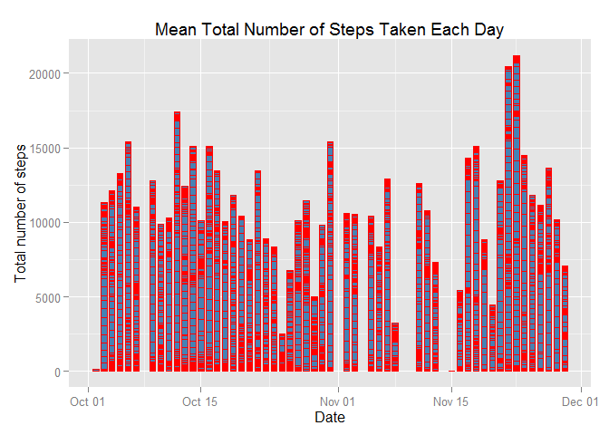
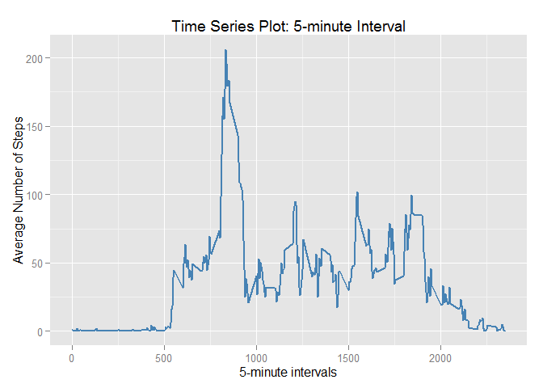

# Reproducible Research: Peer Assessment 1
* * *
#####Author: *Robert A. Lupo*
#
#####Date: *Friday, October 17, 2014*
* * * 

**General settings:**

  * Load data without preprocessing: Data will contain NA values
  * Always make code visible: echo = TRUE
  * **PA** refers to Personal Activity

* * * 

### Loading and preprocessing the data
1. Data file is assumed to be in current directory
2. Attribute classes are set 


```r
raw_Data <- read.csv("activity.csv",sep=",",header=TRUE,
                      colClasses=c("integer","Date","factor"))
```

### What is the mean total number of steps taken per day?
1. NA values are to be ignored
2. Remove the NA values
3. Check removal
4. Graph means using the ggplot2 Library


```r
# First 3 rows of raw data
head(raw_Data,3)
```

```
##   steps       date interval
## 1    NA 2012-10-01        0
## 2    NA 2012-10-01        5
## 3    NA 2012-10-01       10
```

```r
PA_Data  <- na.omit(raw_Data)
# First 3 rows with NAs removed
head(PA_Data,3)
```

```
##     steps       date interval
## 289     0 2012-10-02        0
## 290     0 2012-10-02        5
## 291     0 2012-10-02       10
```

```r
library(ggplot2)
ggplot(PA_Data, aes(date, steps)) + geom_bar(stat = "identity", color = "red", fill = "steelblue", width = 0.7)+ labs(title = "Mean Total Number of Steps Taken Each Day", x = "Date", y = "Total number of steps")
```

 

```r
#calculate the mean and the median
avgDailySteps<-aggregate(PA_Data$steps,list(Date=PA_Data$date),FUN = "sum")$x
mean(avgDailySteps)
```

```
## [1] 10766
```

```r
median(avgDailySteps)
```

```
## [1] 10765
```

### What is the average daily activity pattern?
1. Make a time series plot (i.e. type = "l") of the 5-minute interval (x-axis) and the average number of steps taken, averaged across all days (y-axis)
2. Which 5-minute interval, on average across all the days in the dataset, contains the maximum number of steps?


```r
avgSteps<-aggregate(PA_Data$steps,list(interval=as.numeric(as.character(PA_Data$interval))),FUN=mean)
names(avgSteps)[2] <- "meanSteps"

## time series plot
ggplot(avgSteps, aes(interval, meanSteps)) + geom_line(color = "steelblue", size = 0.8) + labs(title = "Time Series Plot: 5-minute Interval", x = "5-minute intervals", y = "Average Number of Steps")
```

 

#### Inputing missing values
1. Calculate and report number of missing (NA) values 
2. Replace an NA value with the mean for that day
3. Create a new dataset with NAs replaced
4. Graph a histogram of the means using the ggplot2 Library
*4a.Do these values differ from the estimates from the first part of the assignment? 
*4b. What is the impact of imputing missing data on the estimates of the total daily number of steps?

### Are there differences in activity patterns between weekdays and weekends?

1. Convert 'date' factor variables to corresponding weekday/weekend factors
2. Make a panel plot containing a time series plot (i.e. type = "l") of the 5-minute interval (x-axis) and the average number of steps taken, averaged across all weekday days or weekend days (y-axis). 


